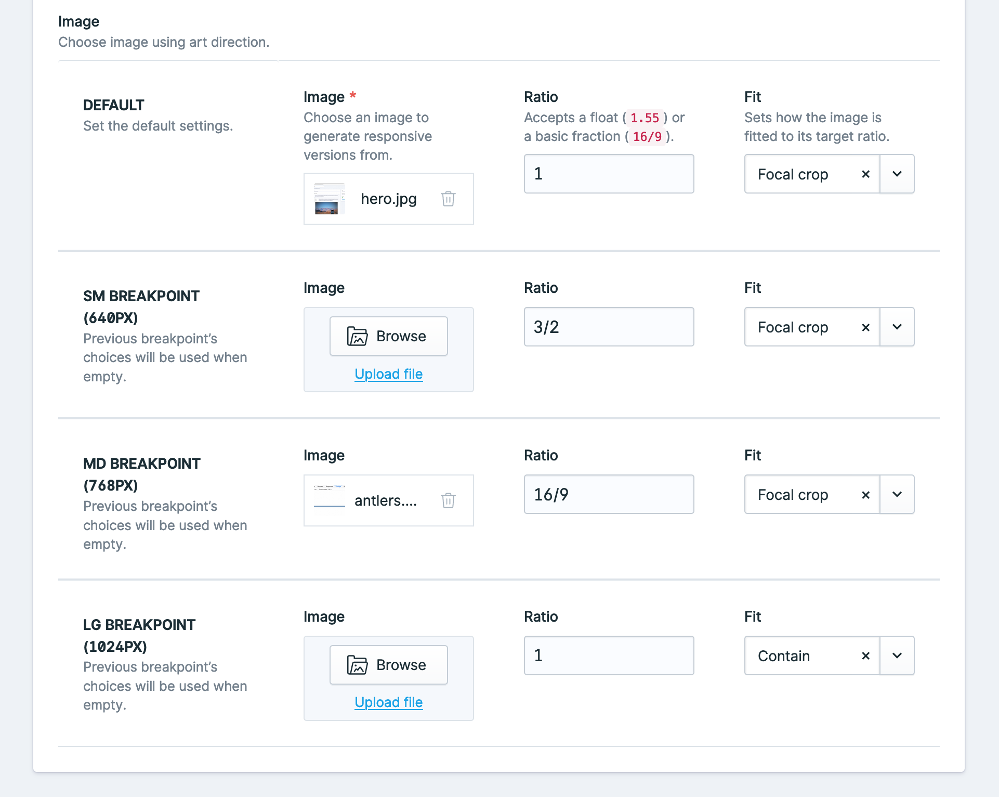

[](https://supportukrainenow.org)

<!-- statamic:hide -->
[](https://github.com/spatie/statamic-responsive-images/releases)


# Responsive Images

> Responsive Images for Statamic 3.

<!-- /statamic:hide -->

This Addon provides responsive images inspired by [Our Medialibrary Package](https://github.com/spatie/laravel-medialibrary).

## Support us

[](https://spatie.be/github-ad-click/statamic-responsive-images)

We invest a lot of resources into creating [best in class open source packages](https://spatie.be/open-source). You can support us by [buying one of our paid products](https://spatie.be/open-source/support-us).

We highly appreciate you sending us a postcard from your hometown, mentioning which of our package(s) you are using. You'll find our address on [our contact page](https://spatie.be/about-us). We publish all received postcards on [our virtual postcard wall](https://spatie.be/open-source/postcards).

## Installation

Require it using Composer.

```
composer require spatie/statamic-responsive-images
```

## Fieldtype

This addon includes a fieldtype that allows for full Art direction with responsive images.



This fieldtype is configured with the following yaml configuration:

```yaml
-
    handle: image
    field:
      use_breakpoints: true
      allow_ratio: true
      allow_fit: true
      breakpoints:
        - sm
        - md
        - lg
      display: Image
      instructions: 'Choose image using art direction.'
      type: responsive
      icon: assets
      listable: hidden
      container: assets
      restrict: false
      allow_uploads: true
```

The configuration above can be used within Antlers using the responsive tag:

```twig
{{ responsive:image }}
```

The breakpoints are configured in the `breakpoints` array of the config file.

## Using Responsive Images

Responsive Images will generate responsive versions of the images whenever a new asset is uploaded. These presets are determined by this package and not by your own Glide presets.

We generally recommend setting `statamic.assets.image_manipulation.cache` to `false` so only images actually requested by a browser are generated. The first time the conversion is loaded will be slow, but Glide still has an internal cache that it will serve from the next time. This saves a lot on server resources and storage requirements.

## Templating

Pass an image to the `responsive` tag.

```twig
{{ responsive:image_field }}
```

This will render an image tag with the default srcsets. The tag uses JS to define the value of the sizes attribute. This way the browser will always download the correct image.

## Image ratio

You can make sure images are a certain ratio by passing a `ratio` parameter, either as a string `16/10` or as a float `1.6`.

```twig
{{ responsive:image_field ratio="16/9" }}
```

## Responsive placeholder

By default, responsive images generates a small base64 encoded placeholder to show while your image loads. If you want to disable this you can pass `placeholder="false"` to the tag.

```twig
{{ responsive:image_field placeholder="false" }}
```

## Webp image generation

By default, responsive images generates webp variants in addition to jpg or png versions of your image, these are usually smaller. If you want to disable this functionality you can pass `webp="false"` to your tag.

```twig
{{ responsive:image_field webp="false" }}
```

## Glide parameters

You can still pass any parameters from the Glide tag that you would want to, just make sure to prefix them with `glide:`.
Passing `glide:width` will consider the width as a max width, which can prevent unnecessary large images from being generated.

```twig
{{ responsive:image_field glide:blur="20" glide:width="1600" }}
```

## HTML Attributes

If you want to add additional attributes (for example a title attribute) to your image, you can add them as parameters to the tag, any attributes will be added to the image.

```twig
{{ responsive:image_field alt="{title}" class="my-class" }}
```

## Breakpoints & Art direction

You can define breakpoints in the config file, by default the breakpoints of TailwindCSS are used.

Breakpoints allow you to use, for example, different ratios:

```twig
{{ responsive:image_field ratio="1/1" lg:ratio="16/9" 2xl:ratio="2/1" }}
```

This will apply a default ratio of `1/1`. From breakpoint `lg` up to `2xl`, the ratio will be `16/9`. From `2xl` up, the ratio will be `2/1`.
The breakpoints can be configured in the config and default to the breakpoints of Tailwind CSS.

Or different assets:

```twig
{{ responsive:image_field :lg:src="image_field_lg" :2xl:src="image_field_2xl" }}
```

Breakpoints support the `ratio`, `src` and `glide` parameters.

## Customizing the generated html

If you want to customize the generated html, you can publish the views using

```bash
php artisan vendor:publish
```

and choosing `Spatie\ResponsiveImages\ServiceProvider`

## Generate command

If you need to regenerate the responsive images for a reason, you can use the `regenerate` command which will clear the Glide cache and regenerate the versions. This command only works when you have the `statamic.assets.image_manipulation.cache` config option set to `true` (which we generally don't recommend).

```bash
php please responsive:regenerate
```

If you are using a service, like Horizon, for queues then jobs will be queued to handle the image resizing.
By default, the job is queued under the 'default' queue. This can be changed via the `queue` config key under `responsive-images.php`

## GraphQL

This addon comes with 2 GraphQL goodies, it adds a `responsive` field to all assets, and allows you to retrieve art directed images through GraphQL as well.

### Responsive field on assets

You can retrieve a responsive version of an asset like this:

```graphql
{
  entries {
    data {
      id,
      image {
        responsive {
          label
          value
          unit
          ratio
          mediaString
          srcSet
          srcSetWebp
          placeholder
        }
      }
    }
  }
}
```

Setting parameters like a ratio is also possible:

```graphql
{
  entries {
    data {
      id,
      image {
        responsive(ratio: 1.2) {
          label
          value
          unit
          ratio
          mediaString
          srcSet
          srcSetWebp
          placeholder
        }
      }
    }
  }
}
```

## Image from the responsive fieldtype with GraphQL

A responsive fieldtype has all the same fields as a normal responsive field from an asset, except they're under a `breakpoints` key.

```graphql
{
  entries {
    data {
      id,
      art_image {
        breakpoints {
          label
          value
          unit
          ratio
          mediaString
          srcSet
          srcSetWebp
          placeholder
        }
      }
    }
  }
}
```

### Changelog

Please see [CHANGELOG](CHANGELOG.md) for more information what has changed recently.

## Contributing

Please see [CONTRIBUTING](https://github.com/spatie/.github/blob/main/CONTRIBUTING.md) for details.

## Security

If you discover any security related issues, please email [security@spatie.be](mailto:security@spatie.be) instead of using the issue tracker.

## Credits

- [Rias Van der Veken](https://github.com/riasvdv)
- [All Contributors](../../contributors)

## License

The MIT License (MIT). Please see [License File](LICENSE.md) for more information.
